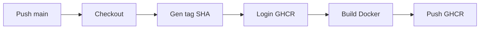
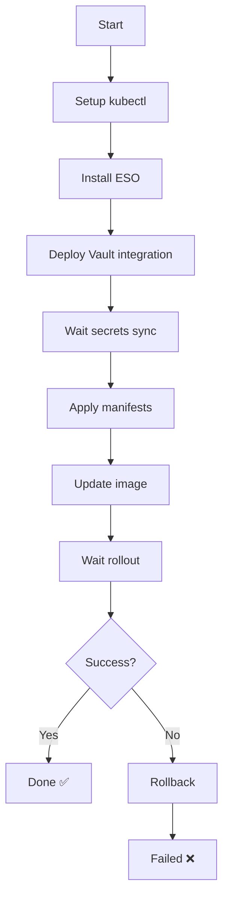

# GitHub Actions - CI/CD Pipeline

Workflow automatisé pour build et déploiement du frontend Next.js sur Kubernetes.

## Déclenchement

Le workflow se déclenche automatiquement sur:
- Push sur la branche `main`

## Jobs

### 1. build-and-push

Build l'image Docker et la push vers GitHub Container Registry (ghcr.io).

**Étapes:**
1. Checkout du code
2. Génération du tag d'image (basé sur le SHA du commit)
3. Login à GHCR
4. Setup Docker Buildx (pour build multi-plateforme)
5. Build et push de l'image avec cache GitHub Actions

**Variables d'environnement** : Les variables `NEXT_PUBLIC_*` sont gérées par Vault et injectées au runtime (pas au build-time).

### 2. deploy

Déploie l'application sur Kubernetes après le build réussi.

**Étapes:**
1. Checkout du code
2. Setup kubectl
3. Configuration kubeconfig (depuis secret)
4. Setup Helm
5. Installation/vérification External Secrets Operator
6. Déploiement de l'intégration Vault (ServiceAccount, SecretStore, ExternalSecret)
7. Attente de la synchronisation des secrets depuis Vault
8. Sauvegarde de l'image actuelle (pour rollback)
9. Application des manifestes Kubernetes
10. Mise à jour de l'image du déploiement
11. Attente du rollout
12. Rollback automatique en cas d'échec

## Secrets GitHub requis

Configurez ces secrets dans **Settings → Secrets and variables → Actions**:

### Obligatoire

1. **`KUBECONFIG_B64`**
   - Description: Contenu du fichier kubeconfig encodé en base64
   - Comment l'obtenir:
     ```bash
     cat ~/.kube/config | base64 -w 0
     ```
   - Donne accès au cluster Kubernetes

### Automatique

2. **`GITHUB_TOKEN`**
   - Description: Token généré automatiquement par GitHub Actions
   - Utilisé pour:
     - Push des images Docker vers GHCR
     - Création du secret docker-registry dans Kubernetes

### Variables d'environnement gérées par Vault

Les variables `NEXT_PUBLIC_API_URL` et `NEXT_PUBLIC_STRIPE_PUBLISHABLE_KEY` ne sont **plus** dans GitHub Secrets. Elles sont maintenant :
- Stockées dans Vault
- Synchronisées via External Secrets Operator
- Injectées au runtime dans les pods Kubernetes

Voir [VAULT_ENV.md](../VAULT_ENV.md) pour la configuration complète.

## Configuration

### Étape 1: Configurer KUBECONFIG_B64

```bash
# Sur votre machine locale avec accès au cluster K3s
cat ~/.kube/config | base64 -w 0
```

Copiez la sortie et ajoutez-la comme secret GitHub `KUBECONFIG_B64`.

### Étape 2: Configurer les variables d'environnement
 dans Vault

Les variables `NEXT_PUBLIC_*` sont maintenant gérées par Vault, pas par GitHub Secrets.

**Configuration initiale de Vault** :
```bash
# Sur votre serveur avec accès à Vault
cd /path/to/project
./update-vault-secrets.sh <VAULT_ROOT_TOKEN>
```

Voir [VAULT_ENV.md](../VAULT_ENV.md) pour plus de détails.
### Étape 3: Vérifier les permissions

Le workflow nécessite:
- **Read** access to contents
- **Write** access to packages (GHCR)

Ces permissions sont configurées automatiquement via:
```yaml
permissions:
  contents: read
  packages: write
```

## Permissions requises dans le cluster

Le kubeconfig doit avoir les permissions pour:
- Créer/modifier des namespaces
- Déployer des ressources (Deployments, Services, Ingress, etc.)
- Gérer les secrets
- Installer des Helm charts (External Secrets Operator)

## Workflow détaillé

### Build phase



L'image est taguée:
- `ghcr.io/etho01/maison-epouvante-front:${GITHUB_SHA}`
- `ghcr.io/etho01/maison-epouvante-front:latest`

### Deploy phase



## Rollback automatique

Si le déploiement échoue après avoir changé l'image, le workflow:
1. Récupère l'image précédente
2. Restaure automatiquement cette image
3. Attend que le rollback se termine

## Cache Docker

Le workflow utilise le cache GitHub Actions pour optimiser les builds:
```yaml
cache-from: type=gha
cache-to: type=gha,mode=max
```

Cela accélère considérablement les builds suivants.

## Vérification du déploiement

Après un déploiement réussi, vérifiez:

```bash
# Status du déploiement
kubectl -n maison-epouvante-front get deployments

# Pods
kubectl -n maison-epouvante-front get pods

# Logs
kubectl -n maison-epouvante-front logs -l app=maison-epouvante-front

# Ingress
kubectl -n maison-epouvante-front get ingress

# Secrets synchronisés
kubectl -n maison-epouvante-front get externalsecret
```

## Troubleshooting

### Échec de build Docker

**Erreur**: `ERROR: failed to solve: failed to compute cache key`

**Solution**: Vérifiez que:
- Le Dockerfile est valide
- Les build-args sont correctement configurés
- Les secrets GitHub sont bien définis

### Échec de déploiement

**Erreur**: `Unable to connect to the server`

**Solution**: Vérifiez le secret `KUBECONFIG_B64`:
```bash
echo "$KUBECONFIG_B64" | base64 -d | kubectl --kubeconfig=/dev/stdin get nodes
```

### Secrets Vault non synchronisés

**Erreur**: `Timeout waiting for Vault secrets synchronization`

**Solutions**:
1. Vérifier que Vault est configuré (voir k8s/vault/configure-vault.sh)
2. Vérifier l'ExternalSecret:
   ```bash
   kubectl -n maison-epouvante-front describe externalsecret
   ```
3. Vérifier le SecretStore:
   ```bash
   kubectl -n maison-epouvante-front describe secretstore vault-frontend
   ```

### Rollback échoue

Si le rollback automatique échoue, rollback manuel:
```bash
kubectl -n maison-epouvante-front rollout undo deployment/maison-epouvante-front
```

## Optimisations

### Build multi-stage

Le Dockerfile utilise un build multi-stage pour:
- Réduire la taille finale de l'image (~150-200MB)
- Améliorer la sécurité (pas de devDependencies en production)
- Optimiser le cache Docker

### Cache GitHub Actions

Le cache GitHub Actions réduit significativement le temps de build:
- **Premier build**: ~5-8 minutes
- **Builds suivants** (avec cache): ~2-3 minutes

### Parallélisation

Les étapes qui peuvent être parallélisées le sont automatiquement par GitHub Actions.

## Monitoring

Pour surveiller les déploiements:

```bash
# Watch pods
kubectl -n maison-epouvante-front get pods -w

# Logs en temps réel
kubectl -n maison-epouvante-front logs -f -l app=maison-epouvante-front

# Événements
kubectl -n maison-epouvante-front get events --sort-by='.lastTimestamp'
```

## Variables d'environnement injectées

Au moment du déploiement, Kubernetes injecte automatiquement (via External Secrets):
- `NEXT_PUBLIC_API_URL`
- `NEXT_PUBLIC_STRIPE_PUBLISHABLE_KEY`

Ces variables sont récupérées depuis Vault et synchronisées dans un Secret Kubernetes.

## Sécurité

- ✅ Images Docker signées et push vers registry privé (GHCR)
- ✅ Kubeconfig stocké en tant que secret GitHub (jamais exposé dans les logs)
- ✅ Variables sensibles gérées via GitHub Secrets
- ✅ Rollback automatique en cas d'échec
- ✅ Utilisateur non-root dans le conteneur (UID 1000)
- ✅ Secrets Kubernetes gérés via Vault et External Secrets Operator

## Notes

- Le workflow ne déploie **pas** les migrations (spécifique au backend)
- Le frontend Next.js est stateless, donc le rollout est simple
- Les middlewares Traefik sont appliqués automatiquement
- Le certificat SSL est géré par cert-manager (automatique)
